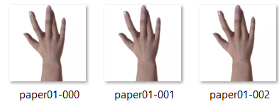
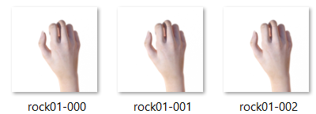
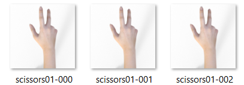
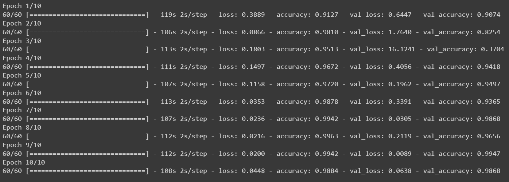
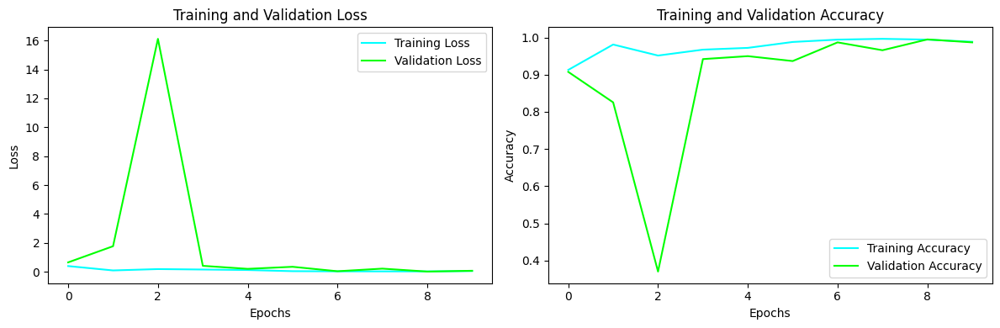

## Authors
Nurhady assydiqi
# Dataset
The dataset used in this project contains a total of 2520 images with an equal proportion of images per class: 840 images for rock, paper, and scissors, respectively.





# Image Classification Web App with Flask

This repository contains a simple web application for image classification built using Flask, allowing users to upload an image and obtain predictions from a pre-trained classification model.

## Table of Contents
- [Authors](#Authors)
- [Dataset](#Dataset)
- [Overview](#overview)
- [Prerequisites](#prerequisites)
- [Installation](#installation)
- [Usage](#usage)
- [File Structure](#file-structure)
- [Web Pages](#web-pages)
- [Notes](#notes)
- [Contributing](#contributing)
- [License](#license)

# traning


# grafik plot


## Overview

The application provides a user-friendly interface where users can upload an image and receive predictions regarding the class or category of the uploaded image.

It utilizes Flask, a lightweight web framework, to handle HTTP requests, perform image classification using a pre-trained model, and render HTML templates to display prediction results.

## Prerequisites

Before running the application, ensure you have the following prerequisites installed:

- Python (version 3.x)
- Required Python packages: `Flask`, `numpy`, `opencv-python`, `PIL`, `tensorflow` (or `tensorflow-cpu`), `scikit-learn`

You can install the required packages using the following command:
```bash
pip install Flask numpy opencv-python Pillow tensorflow scikit-learn
```
## Installation
Clone the repository:
```bash
git clone https://github.com/your-username/image-classification-app.git
cd image-classification-app
```
- Ensure the pre-trained model file (model.h5) is available in the /model/ directory. If not, place the model file in this directory before running the application.
## Usage
Run the application:
```bash
flask run
```
- Open your web browser and navigate to http://localhost:2000/ to access the application.

## File Structure
- app.py: Contains the Flask application code responsible for handling requests, performing predictions, and rendering HTML templates.
- /model/model.h5: Pre-trained model file used for image classification.
- /static/uploads/: Directory where uploaded images are temporarily stored.
- /templates/: Contains HTML templates for different pages of the web application

## Web Pages
### Index Page (index.html)
The index page (/) provides a simple form for users to upload an image for classification.

### Result Page (result.html)
Upon uploading an image, the result page (/predict) displays the predicted class label, accuracy, prediction time, and the uploaded image with the predicted class label.

## Notes
- Make sure to adjust the required Python package versions or any additional configurations needed according to your specific environment setup.
- This README assumes the availability of a pre-trained model file (model.h5). Please ensure the correct path and presence of the model file before running the application.
- Feel free to customize or expand the application according to your needs.

## Contributing
Contributions are welcome! If you have suggestions, improvements, or find any issues, please feel free to open an issue or create a pull request.

